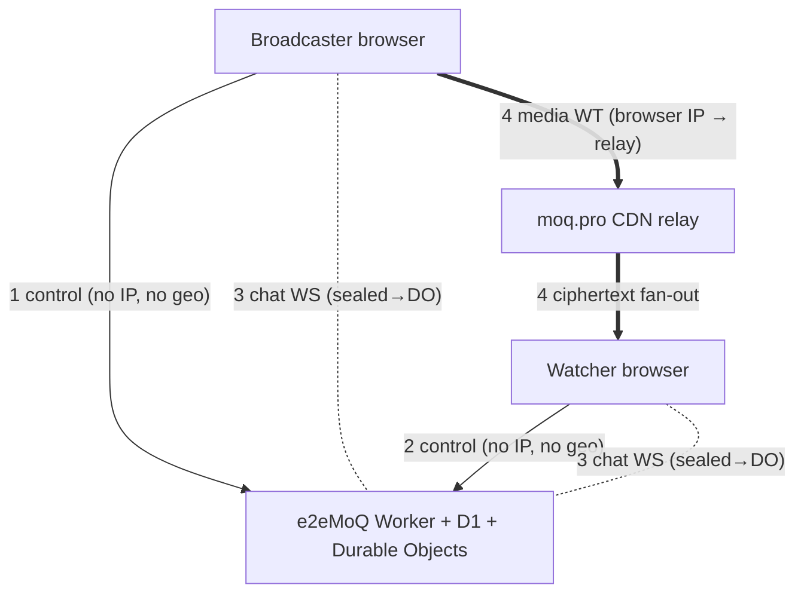

# Communication Flows & Privacy

*Status: working reference (actively evolving). Companion to `security-architecture.html`
(credential layers and content encryption). The public, user-facing version of the
who-can-see-what question is `/trust` on the live site, which is authoritative where the two
ever disagree.*

This document traces the **wire-level messages** between the e2eMoQ app, the two browser
roles (broadcaster / watcher), the backend (Worker + the moq.pro CDN), and the **chat**
channel — with a
privacy annotation on every hop, so we can see exactly **how a user could be identified,
targeted, or revealed**, and where they're protected. The bar for e2eMoQ is very high, so
this is written to expose leaks, not to reassure.

> **Headline:** the tokens, the media path and the control plane are clean. No endpoint
> stores or returns a location, an IP, an IP hash, a cookie or a fingerprint. What remains
> is the network floor — the CDN and Cloudflare necessarily see the address a connection
> arrives from — and that is a VPN/Tor question rather than a software one.

---

## 1. Global facts (apply to every flow)

- **OAuth is disabled → there is no account identity.** `getAuthenticatedUser()` returns a
  hardcoded anonymous user (`id:1`, `anonymous@e2emoq.com`) — `src/worker/index.ts:1459`,
  `src/auth.ts:25`. Every `user_id` written is `1`. The Google OAuth exchange is commented out.
- **Every browser→Worker call is a Cloudflare request**, so Cloudflare (and the Worker) always
  sees the caller's **IP** and `request.cf` (lat/lon/city/region/country/colo/**asn**/
  asOrganization) — even when the JSON body carries no identity. This is transitively true for
  all `/api/*` flows.
- **Tokens are clean.** `MoqClaims = { put:[], get:[<broadcastName>], exp, cluster? }`
  (`src/worker/auth/moq-token.ts:43`). **No IP, geo, email, or account id in any token** — only
  the pseudonymous stream id and an expiry.

---

## 2. The five channels

1. **Control plane** — browser ↔ Worker (`/api/*`). Carries no IP, no IP hash and no geo; a viewing session records only which stream, when it began and when it ended.
2. **Chat plane** — browser ↔ per-stream Durable Object (WebSocket). **End-to-end encrypted**
   under a key derived from the share-link fragment, so the Durable Object relays text it
   cannot read; **separate from media and from the relay**.
3. **Media plane** — browser ↔ the moq.pro CDN (WebTransport), authorised by a short-lived
   token this Worker signs. The relay sees the **browser IP** and ciphertext, and nothing else.

> **There is no discovery plane.** No directory, no lookup service, no DHT, no public index.
> A viewer reaches a broadcast because someone sent them the link, and for no other reason.
> The browser contacts nothing outside Cloudflare and the moq.pro CDN.

---

## 3. Flow inventory (with privacy annotations)

### Group A — Broadcaster browser ↔ Worker

| Flow | Endpoint (file:line) | Payload | Privacy |
|---|---|---|---|
| Go-live | `POST /api/stats/broadcast` | `{stream_id, publisher_cdn}` | No IP stored, no geo captured or stored. Returns a publish JWT. **No content key** — the media key is derived in the browser from the `#k=` fragment, which is never transmitted. |
| End | `POST /api/stats/broadcast/:id/end` (`auth.ts:168`) | none (event id in path) | IP (cf). No geo/token. |
| Stream settings | `GET/POST /api/streams*` (`auth.ts:200,217,235`) | stream id + flags (`require_auth`, `encrypted`, `chat_enabled`) | IP (cf). Pseudonymous stream id only; `user_id=1`. |

### Group B — Watcher browser ↔ Worker

| Flow | Endpoint (file:line) | Payload | Privacy |
|---|---|---|---|
| Route | `GET /api/streams/:id/route` | query: `viewer-cdn` | Authorised by a tag derived from the share link. No IP or geo captured, stored or forwarded. Returns a short-lived moq.pro subscribe token. **No content key** — see above. |
| Watch start | `POST /api/stats/watch` | `{stream_id}` | Authorised by the link-derived tag. Records which stream and when. No IP, no IP hash, no geo, no cookie, no fingerprint. |
| Watch end | `POST /api/stats/watch/:id/end` (`auth.ts:191`) | none | IP (cf). |
| Live stats | `GET /api/stats/live` | — | Returns which streams are live and how many sessions are watching. There is no geo, no IP, no email and no account to expose. |
| Per-stream viewers | `GET /api/stats/stream/:id/viewers` | — | Gated on the link-derived tag, so a stream id alone is not enough. Returns one row per session — the word "Viewer" and a duration. ⚠️ Everyone holding the link can therefore see audience size, not just the broadcaster. |

### Group C — Worker ↔ moq.pro

There is no server-to-server call. The Worker mints a short-lived Ed25519-signed token scoped to one
broadcast path and hands it to the browser, which presents it to `cdn.moq.pro` itself. moq.pro holds
only the **public** half of the signing key, so it can verify our tokens and cannot forge one.

Nothing about the user travels on this path, because the path does not exist: no viewer IP, no geo,
no account, no request from us to them at all.

### Group D — Browser ↔ moq.pro (WebTransport) — *the relay sees the real browser IP*

| Flow | Connect URL (file:line) | Privacy |
|---|---|---|
| Publisher connect | `https://<relay>/?jwt=` (`main.ts:1247`) | **Relay/box sees broadcaster IP.** Token = stream id scope, no identity. |
| Viewer connect | `cdn.moq.pro` + subscribe token | **The CDN sees the viewer IP.** Token is subscribe-only and scoped to one stream id. |

### Group E — Admin (not a normal-user flow)

| Flow | Endpoint (file:line) | Privacy |
|---|---|---|
| Admin | `/api/admin/*` | Auth is the `ADMIN_PASSWORD` secret (`wrangler secret put`); unset disables the admin surface entirely. Still a shared password rather than per-user. No emails or accounts exist for a response to include. |

---

## 4. Chat — the separate encrypted channel

Chat lives in `src/worker/chat-room.ts` (Durable Object), `src/chat/chat-client.ts` (browser),
route at `index.ts:475`. It is **completely separate from the media path and the relay.**

- **Transport:** WebSocket `wss://<host>/api/streams/<id>/chat` → one **Durable Object per
  stream** (Hibernation API). Fan-out to all connected sockets (`chat-room.ts:66`).
- **Message on the wire:** client sends `{type:"msg", name, text}`; the DO stamps
  `{id:uuid, name, text, ts}` (`chat-room.ts:60`). **No user id, token, pubkey, stream id, or IP
  in the message.**
- **Identity = a self-chosen, spoofable display name.** **No authentication required to chat**
  (the route checks only `chat_enabled`). Anyone holding the link can chat under any name.
  There are no accounts, so nothing is ever pre-filled and no real name can leak this way.
- **Storage:** the **last 50 messages persist in Durable Object storage** with **no TTL and no
  deletion when the broadcast ends** (`chat-room.ts:61`). New joiners receive that history. The
  stored rows are ciphertext, so the exposure is bounded by who holds the link, not by the server.
- **Who reads it:** **only people holding the share link.** Messages and display names are
  sealed in the browser with AES-GCM under a key derived from the `#k=` fragment through a
  different HKDF context than the media key, so Cloudflare (the DO operator) relays text it
  cannot read. The **relay never sees chat** either. The broadcaster sees it because they hold
  the link, not because of any privilege. Consequence worth stating: there is no moderation of
  chat, because there is nothing for the operator to read.
- **IP/metadata:** Cloudflare sees the socket's IP at the edge, but the chat code **never reads,
  logs, or stores it**; messages carry no IP. Presence is a live socket count only (no roster).

---

## 5. What actually identifies a user

Only these exist in the whole system:

1. **IP** — ambient on every browser→Worker and browser→relay call, and visible to Cloudflare
   and the CDN. Never stored by us. The real deanonymizer, and a VPN/Tor question.
2. **Stream id** — pseudonymous; identifies a *stream*, not a person (unless linked
   elsewhere).
3. **Chat display name** — self-chosen and sealed under the chat key; a self-doxxing vector only
   in the sense that a user may type their own name into it.
4. **Tokens carry none of the above** — clean.

There is no location, no IP hash, no cookie, no fingerprint and no account anywhere in the
system, so they do not appear on this list.

---

## 6. How a user gets revealed — ranked exposures

**MEDIUM — audience size is visible to every link holder, not just the broadcaster.**
The viewers endpoint is authorised by a tag derived from the share-link secret — and every
viewer necessarily holds that secret, because it is what decrypts the video. So anyone the link
reached, including anyone it was forwarded to, can ask how many people are watching and for how
long, without connecting. It is not public: a stranger gets the same "offline" answer as for a
stream that does not exist. But it is a presence signal, and it outlives the broadcast it was
shared for.

**MEDIUM — raw browser IP exposed to the CDN.**
The browser connects to moq.pro directly, so the relay sees the viewer's or broadcaster's real IP
alongside the pseudonymous stream id. This is the network floor: it cannot be removed in software,
because someone has to carry the packets. A VPN or Tor is the user's own answer to it. We store
none of it, and it is never bound to content on our side — but moq.pro necessarily sees it.

**LOW — chat persistence.**
Chat is end-to-end encrypted: messages and display names are sealed in the browser under a key
derived from the share link, so Cloudflare relays ciphertext. What remains is retention — the
last 50 messages persist in the Durable Object with no expiry and no end-of-broadcast deletion.
They are ciphertext, so the exposure is bounded by the link rather than by the server, but a TTL
is still the right behaviour. There is no account and no real name to auto-fill.

**LOW / operational — admin surface.**
Admin endpoints are guarded by the `ADMIN_PASSWORD` secret (`wrangler secret put`); when it is
unset the admin surface is disabled entirely. No credential lives in source, and there are no
accounts and no email addresses for any endpoint to return.

---

## 7. What already protects users

- **No accounts.** OAuth off → no durable account identity; every user is anon `id:1`.
- **Clean tokens.** No IP/geo/email/account id in any JWT — only a pseudonymous stream id + exp.
- **Relay is content-blind and chat-blind.** Media reaching moq.pro is ciphertext; chat never
  touches the relay at all.
- **No IP in tokens, messages, or chat records.** IP is transient at the edges, not bound to
  content in app storage (except the geo-derived-from-IP that *is* stored — see §6 HIGH).
- **Media path carries no geo**; geo lives only in the control plane.

---

## 8. Recommendations (ranked to the high-privacy bar)

1. **Rate-limit the viewers endpoint**, and say plainly on `/trust` that audience size is
   visible to everyone holding the link — rather than leaving people to discover it.
2. **Chat retention.** Add a TTL, or delete the Durable Object's storage when the broadcast
   ends. The stored messages are ciphertext, so this is housekeeping rather than a leak — but
   "nothing is kept" is not a claim that can be made while fifty of them sit there.
3. **CDN IP exposure** is the network floor — the user's own tool (Tor/VPN); it cannot be
   removed in software. Document it honestly rather than implying otherwise.

---

## 9. Summary — per flow

Legend — IP: peer sees the browser IP directly **(Y)** / only via Cloudflare **(cf)** / not at
all **(N)**. Every cell in the Geo column is **N**; the column is kept to show that.

| # | Flow | IP | Geo | Token | Account id | Persists? |
|---|---|---|---|---|---|---|
| A1 | go-live `/api/stats/broadcast` | cf | N | returns publish token | anon(1) | stream id + timestamps |
| A2 | end broadcast | cf | N | N | N | ended_at |
| A3 | stream settings | cf | N | N | anon(1) | flags |
| B1 | route `/api/streams/:id/route` | cf | N | subscribe token (**no key**) | N | N |
| B2 | watch start `/api/stats/watch` | cf | N | link-derived tag | anon(1) | stream id + timestamps |
| B3 | live / per-stream viewers | cf | N | **link-derived tag** | anon | reads D1 (counts only) |
| C | Worker ↔ moq.pro | — | — | — | — | *no such call; the browser carries the token* |
| D1-4 | browser→moq.pro WT connect | **Y (CDN)** | N | **Y** (stream-scoped) | N | N |
| Chat | `/api/streams/:id/chat` WS | cf | N | N | display name | **last 50 in DO, no TTL** |
| Admin | `/api/admin/*` | cf | N | `ADMIN_PASSWORD` secret | N | — |
