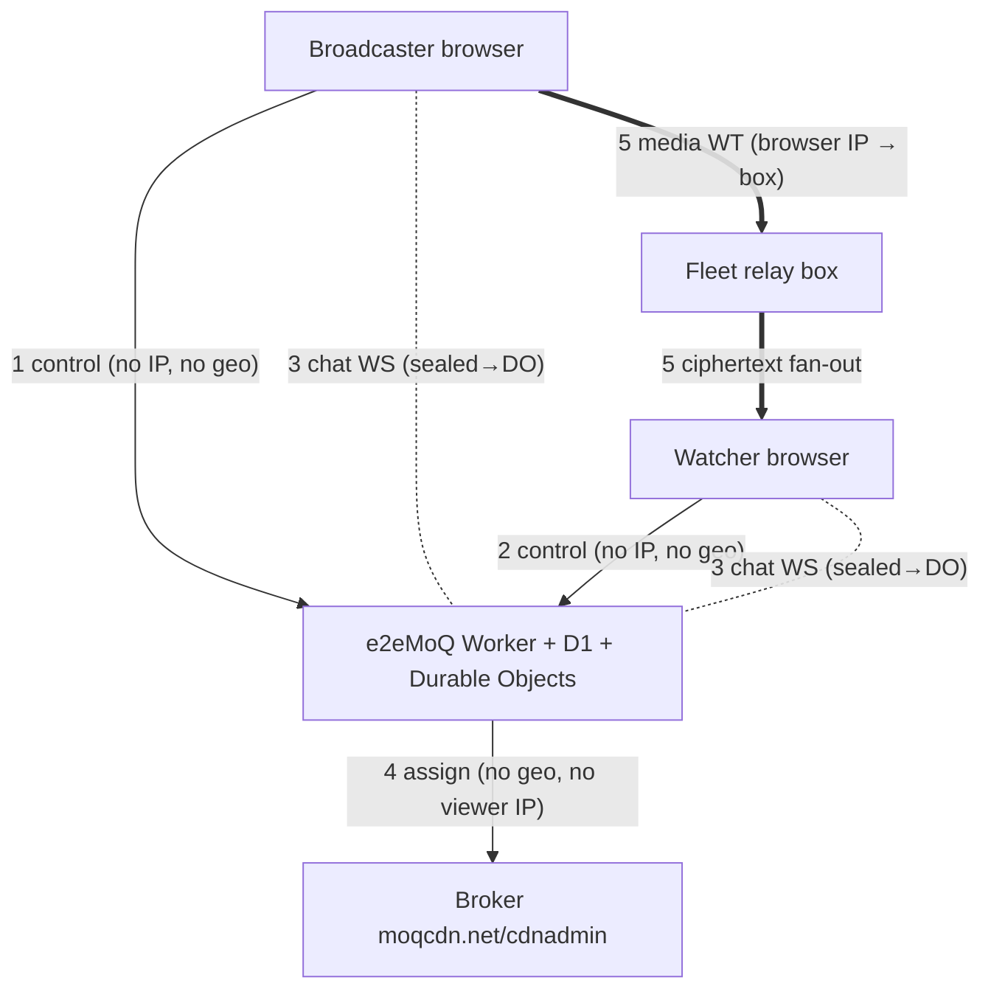

# Communication Flows & Privacy

*Status: working reference (actively evolving). Companion to `security-architecture.html`
(credential layers and content encryption). The public, user-facing version of the
who-can-see-what question is `/trust` on the live site, which is authoritative where the two
ever disagree.*

This document traces the **wire-level messages** between the e2eMoQ app, the two browser
roles (broadcaster / watcher), the backend (broker + fleet), and the **chat** channel — with a
privacy annotation on every hop, so we can see exactly **how a user could be identified,
targeted, or revealed**, and where they're protected. The bar for e2eMoQ is very high, so
this is written to expose leaks, not to reassure.

> **Headline:** the tokens, the media path and the control plane are clean. The geolocation
> surface this document was originally written about **no longer exists** — every `geo_*`
> column was dropped and its data destroyed, and no endpoint stores or returns a location.
> What remains is the network floor: the CDN and Cloudflare necessarily see the IP a
> connection arrives from, which is a VPN/Tor question rather than a software one.

---

## 1. Global facts (apply to every flow)

- **OAuth is disabled → there is no account identity.** `getAuthenticatedUser()` returns a
  hardcoded anonymous user (`id:1`, `anonymous@e2emoq.com`) — `src/worker/index.ts:1459`,
  `src/auth.ts:25`. Every `user_id` written is `1`. The Google OAuth exchange is commented out.
- **Every browser→Worker call is a Cloudflare request**, so Cloudflare (and the Worker) always
  sees the caller's **IP** and `request.cf` (lat/lon/city/region/country/colo/**asn**/
  asOrganization) — even when the JSON body carries no identity. This is transitively true for
  all `/api/*` flows.
- **Tokens are clean.** `MoqClaims = { put:[], get:[<broadcastName>], exp, cluster? }`
  (`src/worker/auth/moq-token.ts:43`). **No IP, geo, email, or account id in any token** — only
  the pseudonymous stream id and an expiry.

---

## 2. The five channels

1. **Control plane** — browser ↔ Worker (`/api/*`). Carries no IP, no IP hash and no geo; a viewing session records only which stream, when it began and when it ended.
2. **Broker plane** — Worker ↔ broker. Server-to-server; carries neither geo nor viewer IP.
3. **Chat plane** — browser ↔ per-stream Durable Object (WebSocket). **End-to-end encrypted**
   under a key derived from the share-link fragment, so the Durable Object relays text it
   cannot read; **separate from media and from the relay**.
4. **Media plane** — browser ↔ relay box (WebTransport). Box sees the **browser IP**; media is
   ciphertext (fleet flow).

> **Resolved 2026-08-15 — the discovery plane is gone.** This document previously carried a
> fifth plane: browser ↔ public pkarr relays, which exposed the browser IP and the nodeId being
> published or looked up to third-party infrastructure outside Cloudflare. The DHT path was
> removed upstream on 2026-08-15, before e2eMoQ was forked — no code for it has ever existed
> in this repository, so **no browser contacts a pkarr relay and no record about
> any broadcast is published anywhere public.** The two ⚠️ findings below are closed.

---

## 3. Flow inventory (with privacy annotations)

### Group A — Broadcaster browser ↔ Worker

| Flow | Endpoint (file:line) | Payload | Privacy |
|---|---|---|---|
| Go-live | `POST /api/stats/broadcast` | `{stream_id, publisher_cdn}` | No IP stored, no geo captured or stored. Returns a publish JWT. **No content key** — the media key is derived in the browser from the `#k=` fragment, which is never transmitted. |
| End | `POST /api/stats/broadcast/:id/end` (`auth.ts:168`) | none (event id in path) | IP (cf). No geo/token. |
| Stream settings | `GET/POST /api/streams*` (`auth.ts:200,217,235`) | stream id + flags (`require_auth`, `encrypted`, `chat_enabled`) | IP (cf). Pseudonymous stream id only; `user_id=1`. |

### Group B — Watcher browser ↔ Worker

| Flow | Endpoint (file:line) | Payload | Privacy |
|---|---|---|---|
| Route (fleet) | `GET /api/streams/:id/route` | query: `viewer-cdn, origin, xport` | Worker reads ASN for relay placement and does not store it; no geo is captured or forwarded. Authorised by a tag derived from the share link. Returns a viewer/pull JWT. **No content key** — see above. |
| Watch start | `POST /api/stats/watch` | `{stream_id}` | Authorised by the link-derived tag. Records which stream and when. No IP, no IP hash, no geo, no cookie, no fingerprint. |
| Watch end | `POST /api/stats/watch/:id/end` (`auth.ts:191`) | none | IP (cf). |
| Live stats | `GET /api/stats/live` | — | Returns which streams are live and how many sessions are watching. There is no geo, no IP, no email and no account to expose. |
| Per-stream viewers | `GET /api/stats/stream/:id/viewers` | — | Gated on the link-derived tag, so a stream id alone is not enough. Returns one row per session — the word "Viewer" and a duration. ⚠️ Everyone holding the link can therefore see audience size, not just the broadcaster. |

### Group C — Worker ↔ broker / fleet

| Flow | Endpoint (file:line) | Payload | Privacy |
|---|---|---|---|
| Brokered assign | `POST <broker>/cdn/assign` (`index.ts:1124`) | `{broadcast, origin?, pull?, xport?, hints}`; `hints=brokerHints()` | **No viewer IP** (Worker-origin), but **deliberately re-injects precise viewer geo** `{lat,lon,country,colo}` (`index.ts:1024`). Auth = `CDN_API_TOKEN` (tenant, not user). Broadcast name pseudonymous. |
| Direct assign/release | `GET <box>/assign\|/release` (`index.ts:1073,1205`) | broadcast name | Server-to-server; **no geo/IP forwarded** in direct mode. Provision bearer (tenant secret). |
| Origin EID lookup | `GET <box>/iroh?port=` (`index.ts:990`) | — | Server-to-server; no user data. |

### Group D — Browser ↔ relay (WebTransport) — *box sees the real browser IP*

| Flow | Connect URL (file:line) | Privacy |
|---|---|---|
| Publisher connect | `https://<relay>/?jwt=` (`main.ts:1247`) | **Relay/box sees broadcaster IP.** Token = stream id scope, no identity. |
| Viewer connect | `https://<relay>/?jwt=` (`main.ts:2177`) | **Edge box sees viewer IP.** Subscribe token, stream id scope only. |
| Enterprise (Mode C) | `/assign` + connect (`main.ts:1582,1598`) | **Private relay sees viewer IP.** Watch + browser-couriered pull token. |
| Probes | `:8888/fingerprint`, `/edge_xport` (`main.ts:432,577`) | Direct browser→box: box sees browser IP; no token. |

### Group E — Browser ↔ discovery — **REMOVED 2026-08-15**

This group no longer exists. It covered the node-id flow: `POST /api/publish`, `POST /api/edge`,
and the `Pkarr.relayPut` / `relayGet` calls in `dht.ts`. Every one of those code paths has been
deleted — `dht.ts` and `nodeid.ts` are gone from the tree, the two Worker routes are gone, and
`pkarr` is no longer a dependency. **The browser now contacts no third party outside Cloudflare
and the fleet box.**

Closed with it: the un-encrypted node-id media path (there is no longer any path that publishes
plaintext), and the world-readable `nodeId → origin EndpointId` record.

### Group F — Admin (not a normal-user flow)

| Flow | Endpoint (file:line) | Privacy |
|---|---|---|
| Admin | `/api/admin/*` | Auth is the `ADMIN_PASSWORD` secret (`wrangler secret put`); unset disables the admin surface entirely. Still a shared password rather than per-user. No emails or accounts exist for a response to include. |

---

## 4. Chat — the separate encrypted channel

Chat lives in `src/worker/chat-room.ts` (Durable Object), `src/chat/chat-client.ts` (browser),
route at `index.ts:475`. It is **completely separate from the media path and the relay.**

- **Transport:** WebSocket `wss://<host>/api/streams/<id>/chat` → one **Durable Object per
  stream** (Hibernation API). Fan-out to all connected sockets (`chat-room.ts:66`).
- **Message on the wire:** client sends `{type:"msg", name, text}`; the DO stamps
  `{id:uuid, name, text, ts}` (`chat-room.ts:60`). **No user id, token, pubkey, stream id, or IP
  in the message.**
- **Identity = a self-chosen, spoofable display name.** **No authentication required to chat**
  (the route checks only `chat_enabled`). Anyone holding the link can chat under any name.
  There are no accounts, so nothing is ever pre-filled and no real name can leak this way.
- **Storage:** the **last 50 messages persist in Durable Object storage** with **no TTL and no
  deletion when the broadcast ends** (`chat-room.ts:61`). New joiners receive that history. The
  stored rows are ciphertext, so the exposure is bounded by who holds the link, not by the server.
- **Who reads it:** **only people holding the share link.** Messages and display names are
  sealed in the browser with AES-GCM under a key derived from the `#k=` fragment through a
  different HKDF context than the media key, so Cloudflare (the DO operator) relays text it
  cannot read. The **relay never sees chat** either. The broadcaster sees it because they hold
  the link, not because of any privilege. Consequence worth stating: there is no moderation of
  chat, because there is nothing for the operator to read.
- **IP/metadata:** Cloudflare sees the socket's IP at the edge, but the chat code **never reads,
  logs, or stores it**; messages carry no IP. Presence is a live socket count only (no roster).

---

## 5. What actually identifies a user

Only these exist in the whole system:

1. **IP** — ambient on every browser→Worker and browser→relay call, and visible to Cloudflare
   and the CDN. Never stored by us. The real deanonymizer, and a VPN/Tor question.
2. ~~**Precise geo (lat/lon)**~~ — **gone.** Every `geo_*` column was dropped and its data
   destroyed; nothing captures or returns a location.
3. **Stream id** — pseudonymous; identifies a *stream*, not a person (unless linked
   elsewhere).
4. **Chat display name** — self-chosen and sealed under the chat key; a self-doxxing vector only
   in the sense that a user may type their own name into it.
5. **Email addresses** — none. There are no accounts anywhere in this product.
6. **Tokens carry none of the above** — clean.

---

## 6. How a user gets revealed — ranked exposures

**~~HIGH — persisted precise geolocation.~~ RESOLVED.**
Every `geo_*` column was dropped and its data destroyed, and the viewers endpoint is now gated on
a tag derived from the share link rather than being public. What is left in its place is a much
smaller finding: **audience size is visible to everyone holding the link**, because every viewer
necessarily has the secret that authorises the query. Not public — a stranger gets the same
"offline" answer as for a stream that does not exist — but not broadcaster-only either.

**HIGH — precise viewer geo deliberately forwarded to an external broker.**
`brokerHints` sends `{lat,lon,country,colo}` to moqcdn.net/cdnadmin on every brokered assign,
even though the Worker→broker hop wouldn't otherwise reveal the viewer.

**MEDIUM — raw browser IP exposed to third-party infrastructure.**
Direct browser→relay connections (media plane) show the **untrusted fleet box** the viewer's/
broadcaster's real IP alongside the pseudonymous stream id (network floor). *Partly resolved
2026-08-15:* the pkarr half of this finding is gone — no browser contacts a public DHT relay any
more, so no third party outside Cloudflare and the fleet box sees an IP↔content linkage. The
network floor against the fleet box remains, and is what a VPN or Tor addresses.

**LOW — chat persistence.**
Chat is end-to-end encrypted: messages and display names are sealed in the browser under a key
derived from the share link, so Cloudflare relays ciphertext. What remains is retention — the
last 50 messages persist in the Durable Object with no expiry and no end-of-broadcast deletion.
They are ciphertext, so the exposure is bounded by the link rather than by the server, but a TTL
is still the right behaviour. There is no account and no real name to auto-fill.

**~~MEDIUM — node-id media path is not encrypted.~~ RESOLVED 2026-08-15.**
The node-id path was removed rather than encrypted. There is now exactly one media path and it
is always end-to-end encrypted, so "no plaintext" holds everywhere without exception.

**LOW / operational — admin surface.**
Admin endpoints are guarded by the `ADMIN_PASSWORD` secret (`wrangler secret put`); when it is
unset the admin surface is disabled entirely. No credential lives in source, and there are no
accounts and no email addresses for any endpoint to return.

---

## 7. What already protects users

- **No accounts.** OAuth off → no durable account identity; every user is anon `id:1`.
- **Clean tokens.** No IP/geo/email/account id in any JWT — only a pseudonymous stream id + exp.
- **Relay is content-blind and chat-blind.** Media is ciphertext (fleet flow); chat never
  touches the relay.
- **No IP in tokens, messages, or chat records.** IP is transient at the edges, not bound to
  content in app storage (except the geo-derived-from-IP that *is* stored — see §6 HIGH).
- **Media path carries no geo**; geo lives only in the control plane.

---

## 8. Recommendations (ranked to the high-privacy bar)

1. ~~**Stop persisting precise geo.**~~ **Done, and further than proposed** — rather than
   coarsening, every geo column was dropped and the data destroyed. `watch_events` still exists
   but holds no identifier of any kind: which stream, when it began, when it ended.
2. **Lock down or remove the geo-exposing stats endpoints now.** `GET /api/stats/stream/:id/
   viewers` is public and leaks stored viewer geo; `GET /api/stats/live` exposes it broadly.
   Gate behind the operator, or strip geo from their responses. *(This is a live leak — highest
   urgency.)*
3. **Coarsen the geo forwarded to the broker** (`brokerHints`) to the same state/country label.
4. **Chat:** add a TTL / delete DO storage on broadcast end. ~~Move to an E2E chat~~ **done** —
   messages and display names are sealed in the browser under a link-derived key.
5. ~~**Encrypt or retire the node-id media path** so "no plaintext" holds everywhere.~~
   **Done 2026-08-15 — retired.**
6. ~~**Replace the hardcoded admin bearer with a Worker secret.**~~ **Done** — `ADMIN_PASSWORD`
   is a secret, and an unset value disables the admin surface rather than defaulting open.
7. ~~**pkarr IP exposure** (node-id flow): self-host a pkarr relay or proxy the put/get through
   the Worker.~~ **Done 2026-08-15** — resolved by removing the flow, so neither mitigation is
   needed. Cross-fleet routing never depended on it (the broker already places viewers).
8. **Relay IP exposure** is the network floor — the user's own tool (Tor/VPN); can't be removed
   in software. Document it honestly.

---

## 9. Summary — per flow

Legend — IP: peer sees browser IP directly **(Y)** / only via Cloudflare **(cf)** / not at all
**(N)**. Geo: **precise** = lat/lon, **coarse** = country/colo, **N** = none.

| # | Flow | IP | Geo | Token | Account id | Persists? |
|---|---|---|---|---|---|---|
| A1 | go-live `/api/stats/broadcast` | cf | **precise → D1** | returns pub JWT | anon(1) | **geo to `broadcast_events`** |
| A2 | end broadcast | cf | N | N | N | ended_at |
| A3 | stream settings | cf | N | N | anon(1) | flags |
| B1 | route `/api/streams/:id/route` | cf | **precise → broker** + ASN | viewer/pull JWT + key | N | N |
| B2 | watch start `/api/stats/watch` | cf | **precise → D1** | N | anon(1) | **geo to `watch_events`** |
| B3 | live / per-stream viewers | cf | N | **link-derived tag** | anon | reads D1 (counts only) |
| C1 | broker `/cdn/assign` | N | **precise (hints)** | CDN_API_TOKEN + pull | N | N |
| C2 | direct assign/release | N | N | provision bearer | N | N |
| D1-4 | browser→relay WT connect | **Y (box)** | N | **Y** (stream-scoped) | N | N |
| ~~E1-4~~ | ~~`/api/publish`, `/api/edge`, DHT put/get~~ | — | — | — | — | **removed 2026-08-15** |
| Chat | `/api/streams/:id/chat` WS | cf | N | N | display name | **last 50 in DO, no TTL** |
| Admin | `/api/admin/*` | cf | N | **static admin bearer** | **emails** | — |
