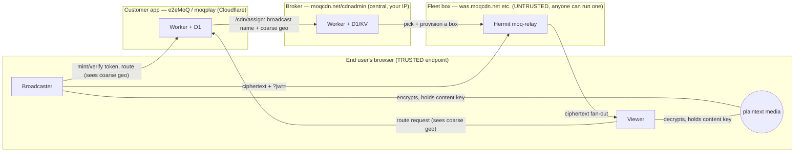

# Trust & Privacy Model

> ## ⚠️ OUT OF DATE — DO NOT CITE
>
> Written before the August 2026 privacy work and now **contradicts the running system** in
> ways that matter. In particular this document states that the Worker holds the content key
> and that `broadcast_events` stores broadcaster geolocation. **Both are false.** Content keys
> never reach the server (they are derived from the share link's `#` fragment, which browsers
> do not transmit), and every geo column was dropped and its data destroyed.
>
> Current and accurate: `public/trust.html` (served at `/trust`) for the public account, and
> the dated security-posture PDF for the audited one. This file is kept only for the threat
> modelling in sections 1-2, which still reads true.

*Status: working reference (actively evolving). Companion to `security-architecture.html`
(content-encryption deep-dive) and `federation-roadmap.html`.*

This document describes **who can see what** across the whole live-streaming system, so we
can reason about — and minimize — what any single party learns about an end user, including
under legal compulsion or seizure.

---

## 1. The goal, stated as a threat model

Two guarantees we want end users (broadcasters **and** viewers) to be able to rely on:

- **Content confidentiality** — no party in the middle (fleet operator, CDN, broker) can
  decode the media. Only the intended endpoints can.
- **Identity protection** — no party can trace a stream back to a person, *even if a powerful
  entity compels or seizes* the customer app (e2eMoQ), the broker (moqcdn.net/cdnadmin),
  or a fleet box.

Explicitly **out of scope** (accepted limits): copy protection after decode (an authorized
viewer can always re-capture decoded frames — this is not DRM), and network-level anonymity
of the viewer's IP from the box that terminates their connection (that is the viewer's own
tool — Tor/VPN — to deploy).

Guiding principle for the compulsion threat:

> **You can only be compelled to reveal what you retain and can enumerate.**
> The levers are *data minimization* (don't store it) and *compartmentalization* (split
> knowledge so no single party can link identity ↔ broadcast ↔ viewer alone).

---

## 2. The parties and the trust boundaries

Trust summary: the **browser endpoints are trusted** (they hold the key and see plaintext).
The **fleet is untrusted** (anyone can run the installer and delegate a box). The **broker**
is central and operated by us but is content-blind and identity-light by design. The **app**
is the most powerful party and the hardest to fully blind (see §6).

---

## 3. The two axes

| | **Content confidentiality** | **Identity / traceability** |
|---|---|---|
| Question | Can party X *decode* the media? | Can party X *link the stream to a person*? |
| Mechanism | AES-256-GCM per-frame; key never sent to the relay | data minimization + pseudonymous identity |
| Status | **Solved vs fleet + broker** (encryption). App can decode today (see §4). | Strong and mostly by omission; see §5 for the per-party surface. |

---

## 4. Content confidentiality (summary)

Full detail in `security-architecture.html`; the essentials:

- Media is encrypted with a **single per-broadcast AES-256-GCM key**
  (`src/crypto/media-crypto.ts`). The publisher encrypts each encoded chunk right after
  WebCodecs encode; viewers decrypt right before WebCodecs decode. **Both audio and video**
  are encrypted (separate build-time seams in `vite.config.ts`; the build fails closed if
  either seam is missing).
- The relay forwards only `[varint ts][nonce][ciphertext+tag]` and **never receives the
  key** — it is relay-blind by construction. The catalog/codec config is left in the clear
  by design (leaks codec/resolution metadata, never content).
- ~~**Today the key is minted by the app's Worker and stored in D1** (`generateContentKey()`)
  — so the *app* (Cloudflare) can decode.~~ **No longer true, and it was the most consequential
  error in this file.** Migration 0010 dropped `broadcast_events.content_key` and moved
  derivation into the browser. `generateContentKey()` survives in `src/worker/index.ts` as
  dead code with **no callers**, which is how this document came to describe an architecture
  the code had already left.
- **The key is derived in the browser from two secrets the server never sees.** HKDF-SHA256
  over the 32-byte link secret (carried after the `#`, which browsers do not transmit) and a
  **mandatory per-broadcast passcode** that is not in the link at all and travels by a channel
  the broadcaster chooses. The passcode is stretched with PBKDF2-SHA256 (210k iterations)
  before mixing. Holding the whole link without the passcode decrypts nothing, and no server
  holds anything a guess could be checked against.

---

## 5. What each party actually knows about a user (code-verified)

### 5a. Fleet box (relay) — *untrusted*

Verified: the moq-relay **never reads, logs, or reports the client IP** (no `peer_addr`/
`remote_addr` anywhere in the relay source); the autoscaler tracks connections only as a
**count**, never per-IP.

- **Sees (transient, packet layer):** the viewer's IP:port — only as live QUIC connection
  state so the kernel can route packets. Never logged or persisted. The box is a **Hermit
  unikernel with no persistent disk / no OS access log**, so nothing accumulates.
- **Processes:** the `?jwt=` → subscribe scope = **broadcast name** (pseudonymous stream id);
  track names; connection duration; byte counts. Media = ciphertext only.
- **Logs** (`node<idx>.log`): `session accepted … root=<broadcast> subscribe=<broadcast>` —
  broadcast scopes, **no IP**.
- **Reports to broker:** counts + egress + customer + broadcast name. No IPs.
- **Ceiling (matters, because fleet owners are untrusted):** the machine terminating the QUIC
  connection *inherently sees the peer IP*, and the broadcast name is in the token. A malicious
  operator with root can therefore observe **"IP X is watching pseudonymous broadcast `<id>`,
  now"** via `tcpdump` regardless of the shipped code. You cannot prevent this in software.
  Mitigations: viewer-side Tor/VPN; keep the broadcast id unlinkable to a person.

**Net:** at most `IP ↔ pseudonymous-broadcast-id ↔ timing/bytes`. No content, no identity,
nothing persisted by the shipped stack.

### 5b. Broker (moqcdn.net/cdnadmin) — *central, ours*

The broker is a hop **behind** the app (Worker→Worker), so it **never sees the viewer's IP**.

- **Receives per `/cdn/assign`:** the `cdn_` customer token (identifies the *app*, not the
  user); the **broadcast name** (pseudonymous); `hints.geo = {lat, lon, country, colo}` — the
  **viewer's coarse location**, forwarded by the app; routing passthrough (`origin`/`pull`/
  `xport`). Its own `request.cf` reflects the *app's* colo, not the viewer.
- **Transient (log-only):** the assign decision `console.log`s coarse geo (`assign.ts`);
  **not written to D1/KV**. ⚠️ *Unless Cloudflare Logpush is enabled* — then it is retained.
- **Persisted (D1, from the poll cycle):** aggregate `box_samples` / `node_samples` /
  `metering_samples` — `node_samples` includes **customer + broadcast name + connection
  count + time + box**. This is a **pseudonymous, enumerable broadcast history** (streams,
  counts, timing) — **never per-viewer, never an IP**.

**Net:** coarse geo (mostly transient) + a pseudonymous broadcast-name history. No IP, no
account, no identity.

### 5c. Customer app (e2eMoQ) — *most powerful party*

- **Sees (transient):** each viewer's request to `/api/streams/:id/route` carries their IP via
  Cloudflare `request.cf`. **No per-viewer record is persisted** — the route handler mints a
  token in memory and returns it; there is no viewer `INSERT`. (Verified: the only viewer-path
  D1 write is the origin-address `UPDATE`; `INSERT INTO users` is OAuth login, not watching.)
- **Holds:** the token-signing key (mints publisher/viewer JWTs); **the content key** (today);
  the broadcast records in D1 (`broadcast_events`, incl. **broadcaster geo** — see §5d).
- **Serves the client code** → this is the deepest exposure: whoever serves the JS *is* the
  client's trusted computing base and can, in principle, backdoor a targeted user (see §6).

**Net:** transient IP visibility per request (not retained), plus whatever it persists in D1
(§5d), plus the code-delivery power.

### 5d. Data-at-rest inventory (what a subpoena/seizure yields)

| Store | Holds | Identity-bearing? |
|---|---|---|
| app `broadcast_events` | stream id, relay host:port, **broadcaster geo** (`geo_country/city/region/latitude/longitude`), content key (today), timestamps | ⚠️ broadcaster location history — **the biggest cut opportunity (§7)** |
| app `streams` | require_auth, overlay, flags | low |
| app `users` | OAuth identities (**only if login is enabled**) | ⚠️ real identities — avoid by staying accountless |
| broker `node_samples` | customer + **broadcast name** + counts + time | pseudonymous broadcast history (enumerable) |
| broker `metering_samples` | customer + relay-seconds (billing) | customer-level only |
| fleet box | *(nothing persisted)* | — |

---

## 6. The hard floors (be honest with users)

1. **IPs are visible at the edges.** The box that terminates a connection sees the peer IP;
   you can decline to *store* it (we do), not to *see* it. Network anonymity is the user's
   tool (Tor/VPN).
2. **The app is the client's TCB.** On the plain web, whoever serves the client JS can
   backdoor it per-user, undetectably. Browser-side encryption protects against a *passive/
   honest* app, not an *active* one. The only real mitigation is a **verifiable client**
   (open source + reproducible build + tamper-proof delivery — extension / native / hash-
   pinned PWA). This is why open-sourcing is a privacy mechanism, not just a business move.
3. **Prospective surveillance.** Minimization defeats "hand over your history," not "start
   logging now" if a party still runs live infra the target uses. Only *structural
   incapacity* (never collect the link) defeats that.
4. **Monetization reintroduces identity.** Paid accounts create a person ↔ pubkey ↔ payment
   record — exactly what gets compelled. If anonymity matters, decouple payment from broadcast
   identity (prepaid credits / blind tokens), or accept "paid tier ≠ anonymous tier."

---

## 7. Minimization roadmap (recommendations)

Ordered roughly by value-per-effort. None of these change the content-encryption engine.

### 7.1 Coarsen geo to US-state / non-US-country only  ⭐ (requested)

**Requirement:** the finest location granularity anywhere in the system should be:
- **US viewers/broadcasters → US state only** (e.g. `US-CA`).
- **Non-US → country only** (e.g. `DE`, `JP`).
- **No city, no precise lat/lon, no sub-country detail outside the US.**

Cloudflare hands the Worker precise `latitude/longitude` + city + region today; we currently
both **store** it (`broadcast_events.geo_*`) and **forward** it to the broker
(`brokerHints → hints.geo.{lat,lon}`). Coarsen at the **e2eMoQ Worker boundary** so precise
geo is dropped before it is ever stored or forwarded:

- **Derive the coarse label** from `request.cf`: `country === "US" ? \`US-${regionCode}\` :
  country`. Discard `city`, `region` (name), `latitude`, `longitude`.
- **Storage:** replace the `geo_country/city/region/latitude/longitude` columns in
  `broadcast_events` with a single coarse `geo_region` string (or null). This removes
  broadcaster location history from the compellable DB.
- **Forwarding to the broker** — two options:
  - *(a, cleanest minimization)* forward only the coarse label; have the broker map
    label → centroid for its haversine ranking. Broker change required.
  - *(b, minimal change)* forward the **state/country centroid** lat/lon (coarse, ~state-
    level precision) so the existing `geo.ts` haversine ranker works unchanged. No broker
    change; precision is capped at state/country by construction.
  - Recommend **(b)** to ship quickly, then **(a)** if we want the broker to hold only labels.
- **Routing impact:** negligible — nearest-fleet selection at state/country granularity is
  more than enough to pick the right regional box.

### 7.2 Broker-side cuts

- **Drop `broadcast` (and `origin`) from `node_samples`.** Billing needs `customer` +
  `relay_seconds` (`metering_samples`), *not* the broadcast name. Removing it deletes the
  enumerable broadcast history from the broker's D1 while keeping billing intact.
- **Confirm Cloudflare Logpush is OFF** for the broker (else the coarse-geo assign log becomes
  retained).

### 7.3 App-side cuts

- **Stay accountless** (no `users` rows) for as long as possible; identity = ephemeral
  browser pubkey. If/when accounts are needed, keep them off the broadcast-identity path (§6.4).
- **Make live broadcast state ephemeral** — reap `broadcast_events` on `ended_at` (or TTL),
  rather than keeping an append-only history, so a seizure yields only currently-live streams.
- **Never log viewer IPs** (already true — keep it that way).

### 7.4 Content-blindness vs the app (optional)

If "not even Cloudflare can decode" becomes a goal: mint the content key in the broadcaster's
browser and deliver it via the share-link fragment (`#k=…`), and stop storing/returning
`content_key`. ~40 lines, no change to the crypto engine. See `security-architecture.html`.

### 7.5 Verifiable client (the TCB ceiling)

To make "trust the app less" real, distribute the open-source client as a **verifiable
artifact** the user can confirm matches the audited source: a store-signed **browser
extension**, a signed **native app**, or a **hash-pinned PWA**. Plain website delivery cannot
make this claim (§6.2).

---

## 8. Possible model shift: per-broadcaster self-hosted app

*(Under consideration.)* Instead of one large e2eMoQ serving everyone, each broadcaster
runs **their own small app instance** (a much simpler moqplay), all calling the same broker
and the same fleet.

**What it buys for privacy:**
- **No central party to compel.** There is no single app that holds every broadcast; each
  instance knows only *its owner's* streams. The concentration risk in §5c/§5d disappears.
- **Compartmentalization by default.** Compelling one instance yields one broadcaster's data,
  not the population's.
- **Fungible + verifiable.** If every instance is the same audited artifact, trusting any
  particular operator matters less — which is exactly the §6.2 / §7.5 direction.

**Costs / open questions:**
- **Deployment friction** — each broadcaster must stand up a Worker (or equivalent) and manage
  their signing key. A one-click deploy + a simplified codebase are prerequisites.
- **Discovery still needs a shared plane** — the self-hosted app removes the *central app*, not
  the need for discovery + provisioning. (Written when a DHT option existed; the DHT path was
  removed from e2eMoQ on 2026-08-15, so the broker is the only answer here now.)
- **The broker remains central** (your IP) — it still provisions capacity and sees the
  pseudonymous broadcast history (§5b). That's acceptable under this model because it is
  already content-blind and identity-light; billing lives here.
- **Support/UX** — self-hosting is a power-user posture; most users may still want a hosted
  instance, so this is likely an *option/tier*, not the only mode.

This shift is the natural companion to open-sourcing moqplay + the fleet manager: it turns
"trust one big app" into "run your own verifiable app," pushing the trust anchor from an
operator to an auditable artifact.

---

## 9. Status at a glance

| Property | Today | After the §7 recommendations |
|---|---|---|
| Fleet can decode content | **No** ✓ | No |
| Broker can decode content | **No** ✓ | No |
| App can decode content | Yes (Option A) | No, if §7.4 adopted |
| Viewer IP stored anywhere | **No** ✓ | No |
| Broadcaster precise geo stored | **Yes** (`broadcast_events`) | **No** — US-state / country only (§7.1) |
| Broker holds enumerable broadcast history | Yes (`node_samples`) | No, if §7.2 adopted |
| Real identities stored | Only if login enabled | No (stay accountless) |
| Client is verifiable (anti-backdoor) | No (web delivery) | Only via §7.5 |
